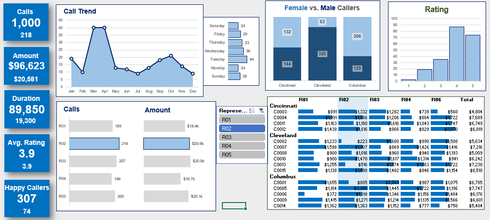
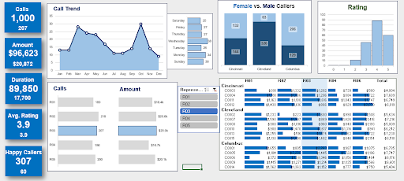
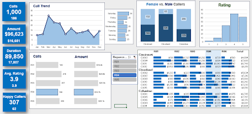
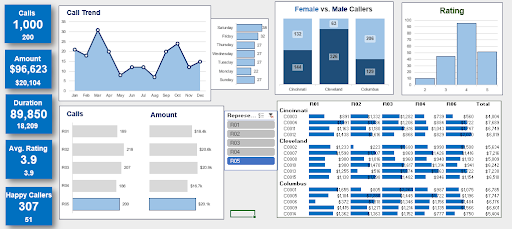

# 📊 Call Center Performance Dashboard (Excel)

An interactive Excel dashboard designed to analyze call center representative performance across key metrics such as call volume, revenue, efficiency, and customer satisfaction.

This project focuses on identifying individual performance patterns, workload distribution, and strategic insights to improve operational efficiency and service quality.

---

## 🎯 Objective

The objective of this project is to analyze the performance of call center representatives using an interactive Excel dashboard.

This analysis focuses on:

- Evaluating individual performance based on call volume, revenue, efficiency, and customer satisfaction  
- Understanding weekly and seasonal workload patterns  
- Identifying high-performing representatives and areas for improvement  
- Providing data-driven insights to support operational and strategic decision-making

---

## 🧰 Tools & Skills Used

- Microsoft Excel  
- Data Modeling (Excel Data Model)  
- Power Pivot  
- DAX (Data Analysis Expressions)  
- Pivot Tables & Pivot Charts  
- Slicers for interactivity  
- Conditional Formatting

---

## 📊 Representative-Level Analysis

### 👤 Representative R01

  

#### 📊 Key Insights
- Specializes in weekend operations, with peak activity on Saturdays and Sundays  
- Handles lower overall call volume (189 calls) but maintains stable revenue ($18.4k)  
- Maintains consistent service quality with a 3.9 average rating  
- Shows seasonal peaks in April and October, with reduced activity toward year-end  
- Strong regional performance in Columbus and Cincinnati clients  

#### 🧠 Summary
> R01 acts as a reliable weekend anchor, ensuring consistent service quality during off-peak business days.

### 👤 Representative R02

  

#### 📊 Key Insights
- Highest call volume (218 calls), acting as the primary workload handler  
- Generates $20.5k revenue with consistent performance across high-volume periods  
- Peaks mid-week, especially on Tuesdays, with strong activity through Wednesday and Thursday  
- Shows strong seasonal performance in March and April  
- Maintains solid customer satisfaction with a 3.9 rating and high number of happy callers  

#### 🧠 Summary
> R02 is the primary mid-week driver, efficiently handling peak call volumes while maintaining consistent service quality.

### 👤 Representative R03

  

#### 📊 Key Insights
- Highest revenue generator ($20.8k) with strong efficiency (~$100.8 per call)  
- Performs best during weekdays, especially Monday and Wednesday  
- Exhibits dual seasonal peaks in Spring and Autumn  
- Maintains stable call volume even during slower mid-year periods  
- Strong performance with high-value clients in Columbus and Cleveland  

#### 🧠 Summary
> R03 is the high-value closer, maximizing revenue through efficient handling of high-impact calls.

### 👤 Representative R04

  

#### 📊 Key Insights
- Lowest call volume (186 calls) and revenue ($16.7k) but handles longer, complex calls  
- Strong presence on Fridays and Saturdays, supporting weekend operations  
- Achieves highest Happy Caller ratio (33.3%), indicating strong service quality  
- Seasonal peak in March with a dip in November and recovery in December  
- Balanced regional performance with strong contributions from Cleveland and Columbus  

#### 🧠 Summary
> R04 is a quality-focused performer, ensuring high customer satisfaction during critical end-of-week operations.

### 👤 Representative R05

  

#### 📊 Key Insights
- Balanced performer with 200 calls and $20.1k revenue  
- Highly active on Saturdays, contributing to weekend workload  
- Maintains steady performance across weekdays  
- Shows seasonal peaks in March and October, with stability toward year-end  
- Strong service quality with a high proportion of 4–5 star ratings  

#### 🧠 Summary
> R05 is a consistent and efficient performer, playing a key role in maintaining weekend performance and service quality.

## 📊 Final Performance Comparison & Strategic Insights

### 1️⃣ Performance Leaderboard

| Metric | Leader | Value | Why it Matters |
|--------|--------|-------|----------------|
| **Total Revenue** | R03 | $20,872 | Highest financial impact with moderate call volume |
| **Call Volume** | R02 | 218 Calls | Handles the highest customer traffic |
| **Efficiency (Revenue/Call)** | R03 | ~$100.8 | Most profitable per interaction |
| **Customer Satisfaction** | R02 | 74 Happy Callers | Highest number of satisfied customers |
| **Happy Caller %** | R04 | 33.3% | Best quality-to-volume ratio |

### 2️⃣ Shift Optimization

- **Weekday Power Team:** R02 (Tuesday peak) and R03 (Wednesday peak) lead mid-week operations  
- **Weekend Anchor Team:** R01, R04, and R05 peak on Saturdays, ensuring strong weekend coverage  

> Insight: High-value weekday calls are handled by R02 and R03, while weekend demand is managed by a dedicated support group.

### 3️⃣ Regional & Client Strength

- **Columbus Specialist:** R03 leads with the highest single-client revenue (C0001 – $2,263)  
- **Cleveland Dominance:** R02 and R05 consistently perform well with high-value clients  
- **Cincinnati Stability:** R01 maintains strong client contribution (C0004 – $1,991)  

> Insight: Representatives demonstrate region-specific strengths that can be leveraged for targeted client management.

### 5️⃣ Final Conclusion

> The team demonstrates a **specialized distribution of roles**, where:
> - **Revenue generation** is driven by high-efficiency performers (R03)  
> - **High-volume operations** are managed by R02  
> - **Customer satisfaction and weekend support** are maintained by R01, R04, and R05  

---

## 📈 Dashboard Features

- Interactive dashboard built using Pivot Tables and Pivot Charts  
- Dynamic filtering using slicers (e.g., representative, region, time)  
- KPI tracking for key metrics such as calls, revenue, and customer satisfaction  
- Comparative analysis across representatives  
- Weekly and monthly trend analysis for performance monitoring  
- Conditional formatting for enhanced data visualization

---

## 📁 Project Structure

📁 call-center-performance-dashboard  
 ├── 📄 call_center_dashboard.xlsx  
 ├── 📁 images/  
 │    ├── r01.png  
 │    ├── r02.png  
 │    ├── r03.png  
 │    ├── r04.png  
 │    └── r05.png  
 └── 📄 README.md  

 ---

 ## 🚀 Key Learnings

- Developed the ability to analyze performance data and extract meaningful business insights  
- Gained hands-on experience with Excel Data Model, Power Pivot, and DAX  
- Built interactive dashboards using Pivot Tables, Pivot Charts, and slicers  
- Improved understanding of KPI design and performance tracking  
- Learned how to present data effectively through structured analysis and storytelling

---

